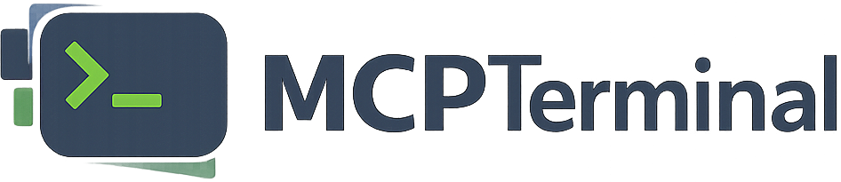

<p align="center">
  
</p>

**A shared terminal: one real shell that both you and an AI assistant can type into.**

You open a terminal. It shows a session code and an access key. You paste those into
your AI chat. From that moment the assistant can type commands into *your* window —
you watch them run live, you can type in the same shell yourself, and everything is
logged. The window title tells you at all times whether the assistant is
`[CONTROLLED]`, `[IDLE]`, or `[DISCONNECTED]`, and the prompt shows a cyan `*` while
it's connected.

Nothing can read or drive a terminal without its access key, so one conversation can
never see or touch another's terminals — see [Access keys](#access-keys).

The shell itself is 100% native — line editing, tab completion, colors, scrollback,
full-screen apps — because it *is* a real shell on a real PTY. MCPTerminal adds a
control channel around it, not a fake terminal in front of it.

---

## ⚠️ Read this first

**MCPTerminal lets an AI assistant type commands into a real shell on your
machine, running as you, with your access.** That is the entire point of the
tool — and it deserves a clear-eyed disclaimer:

- **A connected assistant can run anything you can run.** Read, modify, or
  delete your files; install software; reach your network and any credentials
  your shell can reach. **A session code is a capability** — sharing one is
  like handing over your keyboard. Only share with an assistant you trust.
- **Everything in a session is logged in plain text, indefinitely.**
  `transcript.log` and `screen.log` capture what appears on screen, including
  secrets passed on command lines. (Non-echoed password prompts — `sudo`,
  `ssh` — are generally *not* captured, but do not rely on that.) Logs survive
  uninstall; delete them yourself if you want them gone.
- **Anyone who can write to your user profile can inject commands** into your
  sessions. On Windows the control folder inherits the restricted
  `%LOCALAPPDATA%` ACL; on Unix, MCPTerminal sets session directories to
  owner-only — but don't run this on a machine you don't trust.
- **MCPTerminal Studio runs a local UI in WebView2.** All of its assets are
  vendored locally with a strict Content-Security-Policy — it makes no network
  requests. Nothing in MCPTerminal listens on a network port.
- **Provided as is, without warranty** (MIT). You are responsible for what
  gets run in your terminals.

---

## Contents

1. [Quick start](#quick-start)
2. [Access keys](#access-keys)
3. [The session flow](#the-session-flow)
4. [Status indicators](#status-indicators)
4. [The `info` command](#the-info-command)
5. [Session files explained](#session-files-explained)
6. [CLI reference](#cli-reference)
7. [MCP server](#mcp-server)
8. [Architecture](#architecture)
9. [Building from source & releases](#building-from-source--releases)
10. [Platform notes](#platform-notes)
11. [Security & privacy](#security--privacy)
12. [Troubleshooting](#troubleshooting)

---

## Install in one command

> Requires git + the .NET 10 SDK (`winget install Git.Git Microsoft.DotNet.SDK.10`).
> While this repository is private, authenticate first (`gh auth login`) or use
> the gh-based variant.

**Windows:**
```powershell
powershell -c "irm https://raw.githubusercontent.com/billsecond/MCPTerminal/main/setup/get.ps1 | iex"
```
Private-repo variant:
```powershell
gh repo clone billsecond/MCPTerminal "$env:LOCALAPPDATA\MCPTerminal\source"; & "$env:LOCALAPPDATA\MCPTerminal\source\setup\get.ps1"
```

**Linux / macOS:**
```bash
curl -fsSL https://raw.githubusercontent.com/billsecond/MCPTerminal/main/setup/get.sh | sh
```

This clones the source, builds the terminal (self-contained) + Studio, and
installs shortcuts, Windows Terminal profiles, and the CLI. Re-run anytime to
update. Uninstall: `setup\install.ps1 -Uninstall` / `setup/install.sh --uninstall`.

---

## Quick start

### Windows

```powershell
# from the setup folder:
pwsh -File install.ps1
```

This installs to `%LOCALAPPDATA%\Programs\MCPTerminal` and registers:
- a **Desktop shortcut** (right-click → *Pin to taskbar* for one-click access)
- a **Windows Terminal profile** — "MCPTerminal" appears in the new-tab dropdown

Then: double-click the shortcut (or open a MCPTerminal tab). No arguments needed —
the terminal names itself and shows its session code.

### Linux / macOS

```bash
cd setup && ./install.sh
MCPTerminal
```

Installs to `~/.local/bin/MCPTerminal`. Requires `script(1)` (util-linux or
busybox — present on virtually every distro). Verified working under WSL2 Ubuntu.

### Uninstall

```powershell
pwsh -File install.ps1 -Uninstall     # Windows
```
```bash
./install.sh --uninstall              # Linux/macOS
```

Session logs are always preserved.

---

## Choosing a shell

Every session hosts one shell. Pick it at launch:

| Shell | How to open | Notes |
|---|---|---|
| **PowerShell 7** (default) | double-click the app, the `MCPTerminal` WT profile, or `mcpterm new` | full feature set: live status in `info`, star prompt |
| **Windows PowerShell 5.1** | `MCPTerminal PS5` profile, or `MCPTerminal.exe --shell powershell` | same features as pwsh |
| **CMD** | `MCPTerminal CMD` profile, or `--shell cmd` | header + static `info` macro; status in title only (cmd has no dynamic prompt) |
| **Git Bash** | `MCPTerminal Git Bash` profile, or `--shell bash` (Windows) | requires Git for Windows |
| **bash in WSL** | `MCPTerminal WSL` profile, or `--shell bash-wsl --wsl-distro Ubuntu` | a real Linux bash hosted in the Windows window; `info`/star work via /mnt/c |
| **bash / sh** (Linux, macOS) | just run `mcpterm` / the binary | bash by default, POSIX sh on minimal systems |

The installer registers a Windows Terminal profile for each shell it detects,
so they all appear in the new-tab dropdown. `--wsl-distro` (or the
`MCPTERMINAL_WSL_DISTRO` env var) selects the distro for `bash-wsl`.

---

## Access keys

Terminals are grouped into **tabs** — one tab per conversation. Every tab has a
single random **access key** (`mt_a1b2c3d4e5f6`), and every terminal in it stores
a copy. The key is authentication:

- **Nothing can read, type into, rename or kill a terminal without its key.**
  No key, no access — there is no fallback path.
- **Terminals you hold no key for are not even listed.** `list` reports only what
  your key unlocks, plus a count of how many are locked. One chat cannot discover
  another chat's terminal names, let alone read their transcripts.
- **Creating is always allowed.** An assistant with no key can still call `new` —
  it just gets a brand new tab, with a brand new key, and cannot reach yours.
- **You decide who gets in.** The key is printed in the terminal's own header, by
  the `info` command, and on the pane header in Studio (click to copy). Handing it
  to an assistant is how you grant access; that is the only way in.

```
mcpterm new    -Controller "my chat"          # mints a tab -> prints ACCESS KEY
mcpterm exec   -Id ps-1 -Key mt_a1b2c3d4e5f6 -Command "git status"
mcpterm list   -Key mt_a1b2c3d4e5f6           # only this tab's terminals
```

Lose the key and it cannot be recovered from outside — read it off the terminal
window again. Tabs and their keys live in `tabs.json` under the data root, which
is inside your user profile.

---

## The session flow

```
 you                          the terminal                        the assistant
 ───                          ────────────                        ─────────────
 double-click / run  ───────► opens, prints:
                              "session code: cedar-42"
 paste code into chat ────────────────────────────────────────►  joins the session
                              title -> [CONTROLLED]              types commands into
 watch commands run  ◄──────  prompt gains cyan *   ◄──────────  the same shell
 type your own commands ───►  same shell, same state
                              everything logged per-session
```

- **Codes** look like `word-NN` (e.g. `cedar-42`) or the first 8+ characters of the
  session GUID. Either works.
- Any number of terminals can run at once; each is its own session with its own
  code, logs, and state. `mcpterm list` shows them all.
- Typing `exit` (or closing the window) ends the session; its logs remain.

---

## Status indicators

| Where | Shows |
|---|---|
| **Window/tab title** | `[DISCONNECTED]` — no assistant yet · `[CONTROLLED]` — assistant active in the last 2 minutes · `[IDLE]` — connected but quiet |
| **Prompt** | cyan `*` prefix while the assistant is connected (last 2 minutes) |
| **`info` command** | full status: connection state, seconds since last command, and *which chat* is controlling the session |

---

## The `info` command

Type `info` in any MCPTerminal terminal:

```
  MCPTerminal session code: cedar-42
  guid   : 1a2b3c4d-....
  logs   : <sessions folder>\1a2b3c4d-...
  status : CONNECTED - controlled by the assistant (last command 4s ago)
  chat   : MCP client - MyProject (D:\repos\MyProject)
  <credits>
```

The `chat` line identifies the controlling conversation — the CLI stamps it on
every connection (defaults to the assistant's project folder; the assistant can
pass a richer description with `-Controller`).

---

## Session files explained

Root: `%LOCALAPPDATA%\MCPTerminal` (Windows) · `~/.local/share/MCPTerminal`
(Linux/macOS) · override with the `MCPTerminal_ROOT` environment variable.

```
<root>/
├── index.json                the master index: GUID → name, shell, status,
│                             window PID, transcript path (what `list` reads)
└── sessions/<GUID>/
    ├── inbox/                COMMAND DROP-OFF. The assistant's CLI writes one
    │                         small file per command (first line = command id,
    │                         rest = the command). The terminal picks it up,
    │                         types it into the shell, then deletes the file.
    ├── outbox/               ACKNOWLEDGEMENTS. For each executed command the
    │                         terminal writes `<id>.done`; the CLI waits for it,
    │                         reads it, then deletes it. Normally empty.
    ├── assistant-cmds.log       ATTRIBUTION. Timestamped list of exactly which
    │                         commands came from the assistant. Since native
    │                         keystrokes can't be color-tagged, this file is
    │                         the authoritative "who typed what" record.
    ├── init.ps1 / init.bash / init.sh
    │                         Generated shell startup script for this session:
    │                         prints the header, defines `info`, and installs
    │                         the connected-star prompt.
    ├── screen.log            RAW mirror of everything that crossed the screen,
    │                         escape codes included - byte-exact replay data.
    ├── state.json            Live session state: name, shell, status, window
    │                         PID, last-assistant-activity (unix seconds), and
    │                         the controlling-chat label.
    └── transcript.log        HUMAN-READABLE transcript (ANSI stripped): every
    │                         prompt, every command from either party, every
                              output. This is the log to read afterwards.
```

Delete any session folder freely once you don't need its history.

---

## CLI reference

`mcpterm.ps1` (PowerShell 7; works from any prompt, used by the assistant):

```
mcpterm new    [-Shell pwsh|cmd|bash] [-Name x] [-Cwd dir] [-Hidden]
mcpterm list
mcpterm exec   -Id <code> -Command "<cmd>" [-Controller "<chat label>"] [-TimeoutSec n]
mcpterm read   -Id <code> [-Tail n]
mcpterm kill   -Id <code>
```

- `exec` types the command into the live terminal (clearing any half-typed input
  first), waits for the acknowledgement, and returns the transcript delta.
- `read` returns the tail of the transcript — including what the *human* typed,
  which is how the assistant can "see" the terminal.
- `-Hidden` creates a headless protocol session (no window) used for structured
  machine work with exact exit codes.

---

## MCPTerminal Studio

An optional WinForms app (`studio/`) that manages your shared terminals in one
window, Cursor/Windsurf-style:

- **Top tabstrip: one tab per conversation** — terminals group automatically by
  the controlling chat's label; ungrouped ones live under "Local".
- **Vertical terminal list** on the left with live **activity indicators**
  (cyan pulse = output right now, green = assistant-controlled) — click through
  terminals like a list.
- **Embedded native terminals** (ConPTY + xterm rendering): PS7 / CMD /
  Git Bash / WSL via the `+` buttons. Full copy/paste: select-to-copy,
  right-click paste, Ctrl+C (with selection) / Ctrl+V.
- **History tab**: full-text search across every past session transcript;
  click a result to read the whole transcript.
- **Integration rule**: Studio is never required — but while it runs, any
  terminal launch (shortcut, CLI, MCP) opens *inside* it. Closing Studio
  terminates its terminals (their logs remain). Standalone windows are
  unaffected either way.

Studio terminals speak the identical session protocol, so `connect`/`exec`/
`read` work the same whether a session lives in Studio or its own window.

---

## Making your assistant use it

The installer offers to write routing rules to your global assistant memory
(`~/.claude/CLAUDE.md`) so **every new chat** runs shell commands through
MCPTerminal. If you skipped that, or your assistant isn't picking it up, see
**[CLAUDE-INSTRUCTIONS.md](CLAUDE-INSTRUCTIONS.md)** for a block you can paste
at the start of a conversation.

Config and MCP servers load at session start — **restart your assistant** (or
open a new chat) after installing.

---

## MCP server

`mcp/server.mjs` — a zero-dependency Node stdio MCP server exposing typed tools:
`terminal_new`, `terminal_list`, `terminal_exec`, `terminal_read`,
`terminal_attach`, `terminal_kill`. Register it in your MCP config, e.g.:

```json
{ "mcpServers": { "mcpterminal": {
    "command": "node",
    "args": ["<path>/MCPTerminal/mcp/server.mjs"] } } }
```

Its initialization instructions tell the connected LLM to act on pasted session
codes (text *or* screenshots) immediately, and to keep terminal traffic to
commands only.

---

## Architecture

```
┌───────────────────────────── MCPTerminal (one process per terminal) ─────────┐
│                                                                             │
│  your keystrokes ──────────────►┐                                           │
│                                 ▼                                           │
│  inbox/*.cmd  ──► InboxPump ──► PTY input ──► REAL SHELL on a PTY           │
│  (assistant)      (grace 1.5s,               Windows: ConPTY                │
│                    clears line first)        Unix:   script(1)              │
│                                 ▲                                           │
│  PTY output ◄───────────────────┘                                           │
│      │                                                                      │
│      ├─► VtFilter ─► your screen   (passes everything through EXCEPT the    │
│      │                              shell's own title-set sequences, so     │
│      │                              the status title always wins)           │
│      ├─► screen.log  (raw)                                                  │
│      └─► transcript.log (ANSI stripped)                                     │
│                                                                             │
│  Housekeeping (1 Hz): status title, resize propagation, state refresh       │
└─────────────────────────────────────────────────────────────────────────────┘
```

Design decisions that came from hard-won lessons:

- **Real PTY, zero emulation.** Early prototypes re-implemented prompts, echo,
  and scrolling — every one of them felt subtly wrong. Hosting the shell on the
  OS's own PTY (ConPTY / `script`) makes native feel automatic.
- **Status belongs in the title + prompt, not in reserved screen rows.**
  In-buffer banners require scroll regions, which silently destroy scrollback;
  floating overlay windows fight the window manager. Titles and prompts are the
  terminal's own UI and cost nothing.
- **File-based control channel.** Commands arrive as files, results leave as
  files. No sockets, no elevation, trivially auditable, and it survives every
  process-isolation and filesystem-view oddity Windows can produce.
- **Never share terminal state with the hosted shell.** The one shared
  save/restore-cursor slot, the one title, the one input line — each caused a
  bug until ownership was made exclusive.

---

## Building from source & releases

Requires the .NET 10 SDK.

```bash
cd app
dotnet build -c Release                       # local build
dotnet publish -c Release -r <rid> --self-contained \
    -p:PublishSingleFile=true -o ../releases/<rid>
```

Release matrix (all published in `releases/`):

| RID | Target | Status |
|---|---|---|
| `win-x64` | Windows 10/11 | ✅ tested |
| `linux-x64` | glibc distros (Ubuntu, Debian, Fedora…) | ✅ tested (WSL2 Ubuntu) |
| `linux-musl-x64` | musl distros (Alpine, docker-desktop) | built, untested |
| `osx-x64` | Intel Macs | built, untested |
| `osx-arm64` | Apple Silicon | built, untested |

Binaries are self-contained single files (~70 MB) — no .NET runtime needed on
the target machine.

---

## Platform notes

- **Windows** — full feature set. Works in classic conhost and as a Windows
  Terminal profile/tab. The shell is PowerShell 7 (`pwsh`).
- **Linux** — shell is `bash` (or POSIX `sh` where bash is absent, e.g. busybox
  environments; `info` and the star prompt work in both). PTY via `script(1)`.
  Window resize propagation is not implemented in v2 (fixed PTY size).
- **macOS** — same Unix path as Linux (`script` ships with macOS). Builds are
  provided but have not been run on real hardware yet.
- **WSL2** — the linux-x64 build is verified end-to-end under Ubuntu.

---

## Security & privacy

- The assistant can run **anything you could run** in that shell, under your
  account. Only share a session code with an assistant/chat you trust, in the
  same spirit as screen-sharing with control handoff.
- **What is logged, exactly:** `transcript.log` (plain text, ANSI stripped),
  `screen.log` (raw byte mirror of the screen), `assistant-cmds.log` (which
  commands came from the assistant), `state.json`/`index.json` (metadata).
  Plain text, **retained indefinitely**, and **kept on uninstall**. Location:
  `%LOCALAPPDATA%\MCPTerminal` / `~/.local/share/mcpterminal` (override with
  `MCPTERMINAL_ROOT`). Delete session folders whenever you like.
- Secrets echoed to the screen or passed on command lines **are captured**.
  Keystrokes are forwarded without separate logging, so non-echoed prompts
  (`sudo`, `ssh` password) generally are not — don't depend on that.
- The control channel is local files under your user profile. Nothing listens
  on the network; the MCP server runs locally over stdio; Studio's UI assets
  are vendored (no CDN) under a strict CSP.
- On Unix, session directories are created owner-only (0700). On Windows they
  inherit the restricted `%LOCALAPPDATA%` ACL.
- Session names and WSL distro names are sanitized before they reach shell
  scripts, command lines, or terminal titles.
- Note that shells inherit your real command history — an assistant (or you)
  pressing ↑ recalls it. Clear or isolate history if that matters to you.
- Installer one-liners fetch and run the `main` branch. Read the scripts, or
  clone and run `setup/install.ps1` yourself if you prefer to pin a commit.

---

## Troubleshooting

| Symptom | Cause / fix |
|---|---|
| Terminal opens then closes instantly | Run it from an existing terminal to see the error; commonly a missing `script(1)` on minimal Linux. |
| Assistant's `exec` times out with "no ack" | The window process died, or the session was created by an older build — open a fresh terminal and use its new code. |
| Pasted code not accepted | Use `mcpterm list` to check the exact name/status; codes are the `word-NN` name or a GUID prefix of a *running* session. |
| Title stuck / wrong | Only MCPTerminal's own status title survives by design — if you see a different title, you're looking at a non-MCPTerminal tab. |
| Garbled characters | The app forces UTF-8 on Windows; if you embed the binary in another host, ensure the console is UTF-8 (`chcp 65001`). |
| First command garbled right after opening | Fixed by a 1.5 s startup grace period in v2 — update if you see this on an old build. |

---

*Credits: run `info` inside any MCPTerminal terminal.*
